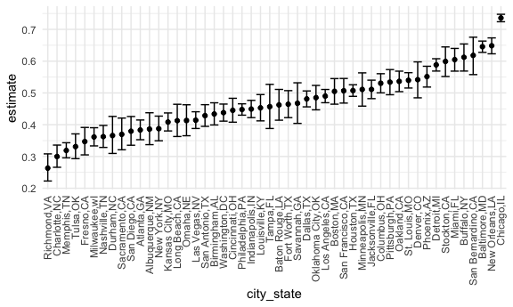
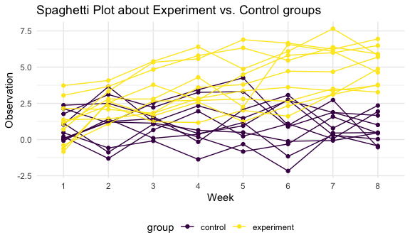

p8105\_hw5\_wq2160
================
Wenshan Qu (wq2160)
11/19/2021

## Problem 1

Raw data

``` r
homicide_df = 
  read_csv("./data/homicides/homicide-data.csv", na = c("", "Unknown"))
```

    ## Rows: 52179 Columns: 12

    ## ── Column specification ────────────────────────────────────────────────────────
    ## Delimiter: ","
    ## chr (8): uid, victim_last, victim_first, victim_race, victim_sex, city, stat...
    ## dbl (4): reported_date, victim_age, lat, lon

    ## 
    ## ℹ Use `spec()` to retrieve the full column specification for this data.
    ## ℹ Specify the column types or set `show_col_types = FALSE` to quiet this message.

Describe: There are 52179 rows and 12 columns in this dataset, and key
variables including uid, reported\_date, victim\_last, victim\_first,
victim\_race, victim\_age, victim\_sex, city, state, lat, lon,
disposition\`.

1.  *Create a city\_state variable (e.g. “Baltimore, MD”) and then
    summarize within cities to obtain the total number of homicides and
    the number of unsolved homicides (those for which the disposition is
    “Closed without arrest” or “Open/No arrest”).*

``` r
homicide_df = 
  homicide_df %>% 
  mutate(
    city_state = str_c(city, state, sep = ","),
    resolution = case_when(
      disposition == "Closed without arrest" ~ "unsolved",
      disposition == "Open/No arrest"        ~ "unsolved",
      disposition == "Closed by arrest"      ~ "solved"
    )
  ) %>% 
  relocate(city_state) %>% 
  filter(city_state != "Tulsa,AL")

homicide_df
```

    ## # A tibble: 52,178 × 14
    ##    city_state     uid        reported_date victim_last  victim_first victim_race
    ##    <chr>          <chr>              <dbl> <chr>        <chr>        <chr>      
    ##  1 Albuquerque,NM Alb-000001      20100504 GARCIA       JUAN         Hispanic   
    ##  2 Albuquerque,NM Alb-000002      20100216 MONTOYA      CAMERON      Hispanic   
    ##  3 Albuquerque,NM Alb-000003      20100601 SATTERFIELD  VIVIANA      White      
    ##  4 Albuquerque,NM Alb-000004      20100101 MENDIOLA     CARLOS       Hispanic   
    ##  5 Albuquerque,NM Alb-000005      20100102 MULA         VIVIAN       White      
    ##  6 Albuquerque,NM Alb-000006      20100126 BOOK         GERALDINE    White      
    ##  7 Albuquerque,NM Alb-000007      20100127 MALDONADO    DAVID        Hispanic   
    ##  8 Albuquerque,NM Alb-000008      20100127 MALDONADO    CONNIE       Hispanic   
    ##  9 Albuquerque,NM Alb-000009      20100130 MARTIN-LEYVA GUSTAVO      White      
    ## 10 Albuquerque,NM Alb-000010      20100210 HERRERA      ISRAEL       Hispanic   
    ## # … with 52,168 more rows, and 8 more variables: victim_age <dbl>,
    ## #   victim_sex <chr>, city <chr>, state <chr>, lat <dbl>, lon <dbl>,
    ## #   disposition <chr>, resolution <chr>

2.  *For the city of `Baltimore, MD`, use the `prop.test` function to
    estimate the proportion of homicides that are unsolved; save the
    output of prop.test as an R object, apply the `broom::tidy` to this
    object and pull the estimated proportion and confidence intervals
    from the resulting tidy dataframe.*

``` r
baltimore_df = 
  homicide_df %>% 
    filter(city_state == "Baltimore,MD")

baltimore_summary = 
  baltimore_df %>% 
    summarize(
      unsolved = sum(resolution == "unsolved"), ## get the number of unsolved cases
      n = n()
    )
  
baltimore_test = 
  prop.test(
    x = baltimore_summary %>% pull(unsolved),
    n = baltimore_summary %>% pull(n)
  )

baltimore_test %>% 
  broom::tidy()
```

    ## # A tibble: 1 × 8
    ##   estimate statistic  p.value parameter conf.low conf.high method    alternative
    ##      <dbl>     <dbl>    <dbl>     <int>    <dbl>     <dbl> <chr>     <chr>      
    ## 1    0.646      239. 6.46e-54         1    0.628     0.663 1-sample… two.sided

3.  *Now run `prop.test` for each of the cities in your dataset, and
    extract both the proportion of unsolved homicides and the confidence
    interval for each. Do this within a “tidy” pipeline, making use of
    `purrr::map`, `purrr::map2`, list columns and unnest as necessary to
    create a tidy dataframe with estimated proportions and CIs for each
    city.*

Write a function:

``` r
prop_test_function = function(city_df) {
  
  city_summary = 
    city_df %>% 
      summarize(
        unsolved = sum(resolution == "unsolved"), 
        n = n()
      )
    
  city_test = 
    prop.test(
      x = city_summary %>% pull(unsolved),
      n = city_summary %>% pull(n)
    )
  
  return(city_test)

}
```

``` r
results_df = 
  homicide_df %>% 
  nest(data = uid:resolution) %>% 
  mutate(
    test_results = map(data, prop_test_function),
    tidy_results = map(test_results, broom::tidy)
    ) %>% 
  select(city_state, tidy_results) %>% 
  unnest(tidy_results) %>% 
  select(city_state, estimate, starts_with("conf"))
```

4.  *Create a plot that shows the estimates and CIs for each city –
    check out `geom_errorbar` for a way to add error bars based on the
    upper and lower limits. Organize cities according to the proportion
    of unsolved homicides.*

``` r
results_df %>% 
  mutate(
    city_state = fct_reorder(city_state, estimate)
  ) %>% 
  ggplot(aes(x = city_state, y = estimate)) +
  geom_point() +
  geom_errorbar(aes(ymin = conf.low, ymax = conf.high)) +
  theme(axis.text.x = element_text(angle = 90, vjust = 0.5, hjust = 1))
```



Alternative way to get same results…using `map2()`

``` r
homicide_df %>% 
  group_by(city_state) %>% 
  summarize(
    unsolved = sum(resolution == "unsolved"),
    n = n()
  ) %>% 
  mutate(
    test_results = map2(unsolved, n, prop.test),
    tidy_results = map(test_results, broom::tidy)
  ) %>% 
  select(city_state, tidy_results) %>% 
  unnest(tidy_results) %>% 
  select(city_state, estimate, starts_with("conf"))
```

    ## # A tibble: 50 × 4
    ##    city_state     estimate conf.low conf.high
    ##    <chr>             <dbl>    <dbl>     <dbl>
    ##  1 Albuquerque,NM    0.386    0.337     0.438
    ##  2 Atlanta,GA        0.383    0.353     0.415
    ##  3 Baltimore,MD      0.646    0.628     0.663
    ##  4 Baton Rouge,LA    0.462    0.414     0.511
    ##  5 Birmingham,AL     0.434    0.399     0.469
    ##  6 Boston,MA         0.505    0.465     0.545
    ##  7 Buffalo,NY        0.612    0.569     0.654
    ##  8 Charlotte,NC      0.300    0.266     0.336
    ##  9 Chicago,IL        0.736    0.724     0.747
    ## 10 Cincinnati,OH     0.445    0.408     0.483
    ## # … with 40 more rows

## Problem 2

**Tidy Data**

``` r
longi_data = 
  tibble(
    list.files(path = "./data/p2_data")
  ) %>% 
  rename(id = `list.files(path = "./data/p2_data")`) %>% 
  mutate(
    path = str_c("./data/p2_data/", id), ## create a r readable path;
    data = purrr::map(path, read_csv) ## and let r read it.
  ) %>% 
  unnest(cols = c(data)) %>% 
  mutate(
    id = str_extract(id, "[0-9]+"),
    group = case_when(
      path %>% str_detect("con") ~ "control",
      path %>% str_detect("exp") ~ "experiment",
    )
  ) %>% 
  select(id, group, week_1:week_8) %>% 
  pivot_longer(
    week_1:week_8,
    names_to = "week",
    names_prefix = "week_",
    values_to = "observation"
  ) %>% 
  mutate(
    group = as.factor(group),
    full_id = str_c(group, id)
  )

longi_data
```

    ## # A tibble: 160 × 5
    ##    id    group   week  observation full_id  
    ##    <chr> <fct>   <chr>       <dbl> <chr>    
    ##  1 01    control 1            0.2  control01
    ##  2 01    control 2           -1.31 control01
    ##  3 01    control 3            0.66 control01
    ##  4 01    control 4            1.96 control01
    ##  5 01    control 5            0.23 control01
    ##  6 01    control 6            1.09 control01
    ##  7 01    control 7            0.05 control01
    ##  8 01    control 8            1.94 control01
    ##  9 02    control 1            1.13 control02
    ## 10 02    control 2           -0.88 control02
    ## # … with 150 more rows

**Spaghetti Plot**

``` r
spag_plot = 
  longi_data %>% 
    group_by(group) %>% 
    ggplot(aes(x = week, y = observation, group = full_id, color = group)) +
    geom_point() +
    geom_line() +
    labs(
      title = "Spaghetti Plot about Experiment vs. Control groups",
      x = "Week",
      y = "Observation"
    )

spag_plot
```



Comment: the observation value of experimental group is generally higher
than control group, and this difference become more and more significant
with time going on. In other words, for patients in control group, the
obs. value is almost the same (slope = 0) with in 8 weeks, while for
patients in experimental group, the obs. value is continuously
increasing (slope &gt; 0) with in 8 weeks.
